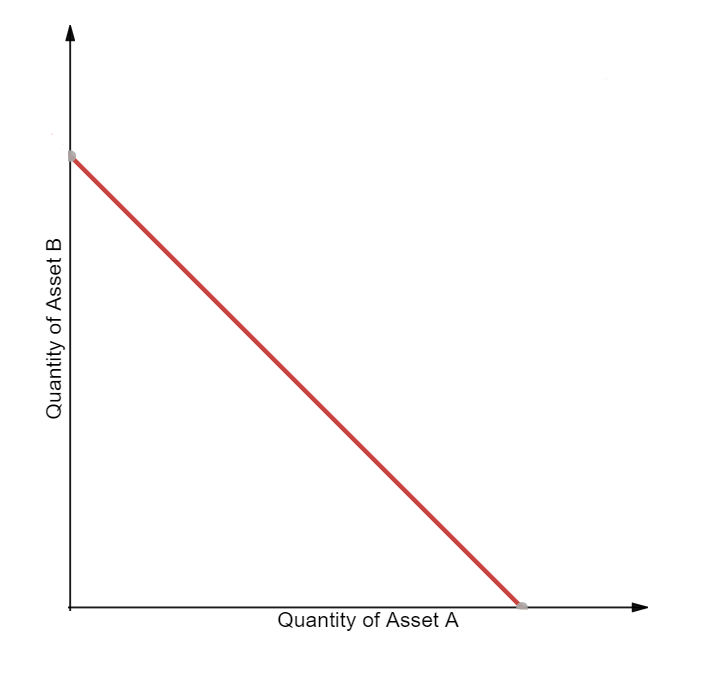

# My_Learning_DeFi
My learning about DeFi

## [Books](./docs/books/)

## Protocol
### Bancor

### Uniswap
* [Introducing Uniswap V3](https://uniswap.org/blog/uniswap-v3/) 
* [Whitepaper v3](https://uniswap.org/whitepaper-v3.pdf)
* [Whitepaper v2](https://uniswap.org/whitepaper.pdf)
* [Whitepaper v1](https://hackmd.io/@HaydenAdams/HJ9jLsfTz)
* [An analysis of Uniswap markets](https://web.stanford.edu/~guillean/papers/uniswap_analysis.pdf)
* [Contracts v1](https://github.com/Uniswap/uniswap-v1)
* [Contracts v2](https://github.com/Uniswap/uniswap-v2-core)
* [Contracts v3](https://github.com/Uniswap/uniswap-v3-core)
* [Documentation v3](https://docs.uniswap.org/)
* [Documentation v3](https://docs.uniswap.org/V2/concepts/protocol-overview/01-how-uniswap-works)
* [Documentation v1](https://docs.uniswap.org/V1/concepts/frontend-integration/01-connect-to-uniswap)
* In return (profit), traders pay a _fee_ to the pool, distributed among Liquidity Provider(s) according to their shares.

### Frax
* It's not an AMM based __DEX__, but algorithmic stablecoin __asset__.
* [Frax: Fractional-Algorithmic Stablecoin Protocol](https://docs.frax.finance/)
* [How arbitrage keeps FRAX price-stable](https://docs.frax.finance/price-stability)


## Education
* Bancor laid the foundation of AMM.
* Uniswap came after Bancor & a better version than the later by 10x reduction in gas consumption.
* Bancor algorithm has been used in 
	- EOSIO RAM market to decide the RAM price. RAM <-> EOS
	- my project TOE (A decentralized Ride sharing platform) to decide the Rides' price. RIDEX <-> EOS
	- [ ] my DeFi project - Cropfi (Stake ur tokens to earn more).
* Liquidity provider: who adds funds into the Liquidity Pool to earn fees from trades in the Swap Pool and also savings interest income. [Source](https://www.binance.com/en-IN/support/articles/dc8f28e7a98d4534ad3db88d351200fb)

### CeFi
* Buyers are interested to buy any stocks/cryptos for the lowest price possible, while seller tries to get the maximum price for their stocks or crypto. Now, these trades get locked in the order book, where the consensus on price is required from both parties to get the trade executed.
* So there can be a situation where the consensus never happens and trades never get executed for a longer period of time, why because there are not enough takers and also due to a liquidity crunch in the exchange.

### DeFi
* DeFi = Blockchain + Finance + Economics
* Decentralized Finance or DeFi is a digtial revolution that leverages decentralized networks to transform our old & ailing financial system into trustless and transparent protocols that run without any third party custodians or intermiediary.
* Some of the concepts driving these:
	- Yield Farming
	- Crypto Staking
	- Crypto lending
	- Crypto Borrowing
	- Liquidity Pool
### Automated Market Maker (AMM)
* A robot that always quotes price b/w 2 assets using 
	- __simple__ formula like in Uniswap while 
	- Curve, Balancer & others use __complicated__ ones.
* Purpose:
	- Anyone can trade trustlessly
	- Anyone can provide fund (also called liquidity) to a liquidity pool. Hence, they can be market maker on exchange. In return, they earn fees for providing liquidity. 
* An AMM is a type of decentralized exchange (DEX) protocol that relies on a mathematical formula to price assets. Instead of using an order book like a traditional exchange, assets are priced according to a pricing algorithm.
* The basic AMM works as a series of pools of two assets (say, ETH, the foundational currency of the Ethereum blockchain,  and DAI, an Ethereum token designed to hold its value against the U.S. dollar). The price offered by the AMM does not reference the external world. In the simplest form, it’s just a function of the ratio of the two assets. So if there were 1 ETH in the pool and 2,000 DAI, 1 DAI would cost 0.0005 ETH and 1 ETH would cost 2,000 DAI.
* History:
	- The concept of AMM used in Uniswap (constant product market maker) has already been studied for over a decade. Refer [this](./docs/papers/AMM_Theory_Practice.pdf)
	- It has been used in prediction markets.
	- Other AMM appoaches:
		+ logarithmic rule used in prediction markets - [Augur v1](https://augur.mystrikingly.com/blog/augur-s-automated-market-maker-the-ls-lmsr) & [Gnosis](https://gnosis-pm-js.readthedocs.io/en/v1.3.0/lmsr-primer.html)
		+ Information aggregators based
			- [Bayesian market makers](http://www.eecs.harvard.edu/cs286r/courses/fall12/papers/bmm-ec.pdf)
			- [dynamic pari-mutuel market makers](https://www.researchgate.net/publication/279714212_A_dynamic_pari-mutuel_market_for_hedging_wagering_and_information_aggregation)
* "constant product market maker" is also called "constant function market makers" (CFMMs).
* Bonding curve: relationship between price & token supply.
* CFMMs: relationship between 2 or more tokens.
* Compound uses non-CFMM because the interest rate is dynamic based on the utilization ration and the goal is not to keep the interest rate constant.

#### CFMM
* The term “constant function” refers to the fact that any trade must change the reserves in such a way that the product of those reserves remains unchanged (i.e. equal to a constant).
* CFMMs typically have three participants:
	- Traders: Exchange one asset for another asset.
	- Liquidity providers (LPs): Willingly accept trades against their portfolio in exchange for a fee.
	- Arbitrageurs: Maintain the price of assets within that portfolio in accordance with the market price in exchange for a profit.
* CFMMs are often used for secondary market trading and tend to accurately reflect, as a result of arbitrage, the price of individual assets on reference markets. For example, if the CFMM price is less than the reference market price, arbitrageurs will buy the asset on the CFMM and sell it on an order book-based exchange for a profit.
* A constant product function forms a hyperbola when plotting two assets, which has a desirable property of always having liquidity as prices approach infinity on both sides of the spectrum.


* A constant product market maker, first implemented by Uniswap, satisfies the equation:


Where R_α and R_β are reserves of each asset and γ is the transaction fee. Trading any amount of either asset must change the reserves in such a way that, when the fee is zero, the product `R_α * R_β` remains equal to the constant `k`.

* This is often simplified in the form of `x*y=k`, where x and y are the reserves of each asset.
* In practice, because Uniswap charges a 0.3% trading fee that is added to reserves, each trade actually increases k.
* Pros:
	- __all-time liquidity__: It can provide liquidity no matter how large the order size is or how small the liquidity pool is. While larger orders tend to suffer from excess slippage, the system never has to worry about running out of liquidity. It will literally always work.
* Cons:
	- __slippage__: is the difference between the expected price of a trade and the price at which the trade is executed. This can be solved by having a large reserve i.e. large value of constant. In this way, the orders should get bigger and bigger so that the slippage is considerable. large order => larger chance of slippage.
	- __Impermanent Loss__: the difference b/w the external market price & pool's price. Suppose, there is a pool with tokens - `ETH : DAI` | `10:1000`, then ETH price is 100 USD, but suppose, the reserve is now `8.17: 1224` after some liquidity movement, still the product is `10000`. In the 2nd case, the price is `150 USD`. Hence, the `$50` in profit is lost to the liquidity provider. Naturally, if the price returned to $100 again, everything would rebalance. That is why this phenomenon is known as impermanent loss. Without a doubt, it is one of the most uncomfortable problems of the Uniswap system. Nobody likes to provide liquidity in exchange for losing value.
```
ETH : DAI
1. 10 1000 -> 10000, ==> 1 ETH = 100 USD
2. 8.17 1224 -> 10000, ==> 1 ETH = 150 USD
``` 

#### Constant Sum Market Makers (CSMM)
* A constant sum market maker is a relatively straightforward implementation of a constant function market maker, satisfying the equation:


Where R_i are the reserves of each asset and k is a constant. 

* While this function produces “zero slippage”, it does not provide infinite liquidity and thus is likely unfit as a standalone implementation for a decentralized exchange use-case.
* A constant sum function forms a straight line when plotting two assets, resulting in the equation `x+y=k`.



#### AMM Formula
* Uniswap - [Whitepaper](https://hackmd.io/C-DvwDSfSxuh-Gd4WKE_ig)
```
x * y = k

where,
x is the amount of one token in the liquidity pool
y is the amount of second token in the liquidity pool
k is a fixed constant, which is the pool's total liquidity always has to remain the same.

> NOTE: k changes during investment/withdrawal transactions, NOT trades
```
* Other AMMs will use other formulas for the specific use cases they target. The similarity between all of them, however, is that they determine the prices algorithmically.
* Traditional market making usually works with firms with vast resources and complex strategies. Market makers help you get a good price and tight bid-ask spread on an order book exchange like Binance. Automated market makers decentralize this process and let essentially anyone create a market on a blockchain.

### Impermanent Loss
* Temporary loss of funds in providing liquidity.
* Why temporary/impermanent?
	- the moment, the price (in centralized exchanges) value comes back to the original price, there is no loss then.
* Suppose, there is a pool with a pair of tokens `X-Y`. Now, a person provides liquidity of `X` & is issued with tokens Y. Now, let's say the price of `X` in the centralized exchanges like Coinbase increase, compared to the Pool price of `X`. Suppose, the price of `X` in pool is `500 USD` & in exchanges it's `550 USD`, then the person would incur a loss. This is called "Impermanent Loss". Now, all the platforms who has these pools, ensure that the market maker (people who provides liquidity) get more incentives (a portion of the fees collected from borrowers). Watch [this](https://www.youtube.com/watch?v=8XJ1MSTEuU0)

### Concentrated Liquidity
* Introduced in Uniswap V3
* The liquidity provider has the choice to part provide liquidity of the token in a specific price range.

### [Flash Loans](./docs/flashloan.md)

### Liquidity Pool
* It is a reservoir of crypto funds mostly in pairs, which works based on the smart contract rules , facilitating user to engage in decentralized, permissionless trading, lending, borrowing activities and in turns getting rewards in the form of the crypto.
* Each pool has mostly 2 tokens. The first Liquidity Provider in a pool has to initiate with deposit `1:1` tokens.
* Basically, liquidity pools contain two assets. As a provider you fund a set amount of both. By adding, you are given a share of the pool. The total amount you provide to the pool increases your share. For instance, if you provide 1000 DAI and 2.5 ETH, your share of the pool may be 5%, whereas someone who provides 50 DAI and 0.02 ETH may only have 0.01%.
* Each time the pool is in use, a fee is taken and distributed to all owners of the pool. The greater your pool share, the bigger cut of the fee. This process incentivizes providers to stay long term keeping the pool healthy, and in turn stabilizes the asset.
* Supplying liquidity through Uniswap is done via a smart contract. In return for your addition you are given pool tokens. At any time you can withdraw your shares, returning your pool tokens to take back your assets. Note: adding or removing funds costs gas, so make sure it counts.
* The proportions of the tokens lying in the Liquidity Pool controls the price of assets in consideration. For example, when you buy ETH from the DAI/ETH pool, the supply of ETH is reduced from the pool, and the supply of DAI is increased proportionally. This will increase the price of ETH and decrease the price of DAI.
* Risks:
	- A bank run may occur for a single asset, which creates supply imbalance. For example, if ETH were to hard fork and drop to 0, everyone would want DAI. Traders would swap out all of their ETH for DAI, and the providers would be left with only ETH unless they remove themselves from the pool prior to the run.
	- The value of one asset may be rising at a volatile rate and as a provider you want to remove your pool share to cash in. When you go to remove the share you find you have more of the other asset. Taking it out of the pool at that time could cause a loss.
* [How to add liquidity to Uniswap --- "Adding Liquidity to a Pool"](https://www.publish0x.com/cryptocurrency-ideas/tutorials-becoming-a-liquidity-provider-with-uniswap-xzyzljg)

#### Withdrawal Fee
* An early withdrawal penalty is charged for withdrawals before an expiry. This is to discourage competitive LP withdrawals ahead of an options expiry. This early withdrawal fee will be applied after the potential claim reserve is deducted. It is calculated according to the following:
[Source](https://docs.divergence-protocol.com/redemption)
	- `0` if no options have been sold since the open, or if LP uses the "expiry exit".
	- `sqrt(1-t) * (1%)`, where t = `(expiryTimestamp − currentTimestamp) / timePeriod` 
	- `1%` penalty cap

#### Yield Farming with LP Tokens

### Slippage
* [Watch this](https://www.youtube.com/watch?v=BgR75biSjzU)

### Oracle
* Used in Bancor v2, Uniswap V3
* It is to adjust the balancer weights to give closer price compared to real-world price (in exchanges).
* It is introduced in many protocols to reduce the Impermanent Loss.

### Glossary
* Liquidity: used in place of 'fund'
* Market Maker or Liquidity Pool: funder who can deposit money into liquidity pool
* Liquidity Pool (LP): paird of tokens collected
* [More](https://www.gemini.com/cryptopedia/explore#de-fi)
* Liquidity Providers (LPs): addresses providing liquidity to pool reserves.


## Development
### Storage
* In DeFi smart contracts, the data is stored on-chain for data persistence required for financial computations.
* But, this can be achieved by either of the two ways:
	1. Minimalistic storage with loops during calculations like average price.
	2. Maximalistic storage with no use of loops during such calculations as the count, & the total amount is also stored.
* In both the methods there are cons. As a matter of fact, the 2nd method is normally chosen.
* But, this has led to expensive scenarios like Chainlink paying 100k USD as gas fees per day.
* In order to avoid this, off-chain storage could be a solution, but it is not secure as the data won't be immutable.
* Hence, there is a new upcoming solution provided by Arweave Blockchain. This has permanent storage. And fetching data from here is absolute free without any API key requirement. The fee is paid one-time which gives storage for almost 100 years. The data (like price) is stored via Arweave smart contracts.
* Have a look at how to access the price [here](./libs/redstone).


## References
### Blogs
* [Automated Market Maker (AMM)](https://academy.binance.com/en/articles/what-is-an-automated-market-maker-amm)
* [Impermanent Loss Explained](https://academy.binance.com/en/articles/impermanent-loss-explained)
* [Curve Finance in DeFi](https://academy.binance.com/en/articles/what-is-curve-finance-in-defi)
* [A Guide to PancakeSwap](https://academy.binance.com/en/articles/a-guide-to-pancakeswap)
* [What Are Liquidity Pools in DeFi and How Do They Work](https://academy.binance.com/en/articles/what-are-liquidity-pools-in-defi)
* [Yield Farming in Decentralized Finance (DeFi)](https://academy.binance.com/en/articles/what-is-yield-farming-in-decentralized-finance-defi)
* [AMM Formula Explained](https://www.binance.com/en/support/faq/33f38db8c23e4a0f949b5433cdc7193a)
* [“Bancor AMM DEX formula calculation example” by CoTrader.com](https://link.medium.com/ZEOBKSzGpeb)
* [“Constant Function Market Makers: DeFi’s ‘Zero to One’ Innovation” by Dmitriy Berenzon](https://link.medium.com/qmwIP0CGpeb)
* [“Liquidity Mining: A User-Centric Token Distribution Strategy” by Dmitriy Berenzon](https://link.medium.com/R01IsfFGpeb)
* [“Synthetic Assets in DeFi: Use Cases & Opportunities” by Dmitriy Berenzon](https://link.medium.com/H3GyoDIGpeb)
* [“P2P Networks and Cryptoassets: A Perfect Match, Decades in the Making” by Dmitriy Berenzon](https://link.medium.com/B45QHRMGpeb)
* [“Crypto borrowing and staking networks” by Jake Brukhman](https://link.medium.com/16twZBPGpeb)
* [“Compound Finance — A Liquidating Opportunity” by Tony W](https://link.medium.com/sgCxsmWGpeb)
* [“Proposing Bancor v2.1: Single-Sided AMM with Elastic BNT Supply” by Bancor](https://link.medium.com/Ap1JKAhHpeb)
* [“Guide: Single-Sided AMM Staking on Bancor V2.1” by Bancor](https://link.medium.com/ROPientHpeb)
* [“How Liquid Tokens Work” by Nate Hindman](https://link.medium.com/mpQcoIuHpeb)
* [“Using Bancor Vortex” by Bancor](https://link.medium.com/xl6H0txHpeb)
* [“How To Stake BNT Liquidity Mining Rewards & Compound Yield” by Bancor](https://link.medium.com/TaPrcvyHpeb)
* [“Bernard Lietaer, A Financial Justice Warrior Who Fought for Freedom of Currency” by Galia Benartzi](https://link.medium.com/GsmIy7AHpeb)
* [“What the heck is an automated market maker (AMM)?” by Nightly Crypto](https://link.medium.com/M4CXZWwVqeb)
* [“The Future of algorithmic stable coin” by Sigma Protocol](https://link.medium.com/M50rRFvWqeb)
* [“The Biggest Hurdle Facing Decentralized Finance (DeFi)” by John Anthony Radosta](https://link.medium.com/PoQevGyWqeb)
* [“I Want To Explain DeFi To My Parents” by Anthony Albertorio](https://link.medium.com/i9kdMdJWqeb)
* [“Diving into Real World DeFi” by Andy Singleton](https://link.medium.com/APvM1hxXqeb)
* [Uniswap: A Good Deal for Liquidity Providers?](https://pintail.medium.com/uniswap-a-good-deal-for-liquidity-providers-104c0b6816f2)
* [Liquidity Pools Explained](https://finematics.com/liquidity-pools-explained/)
* [What Are Automated Market Makers?](https://www.gemini.com/cryptopedia/amm-what-are-automated-market-makers#section-automated-market-maker-variations)
* [Impermanent Loss in Decentralized Finance](https://www.gemini.com/cryptopedia/decentralized-finance-impermanent-loss-defi)
* [How Liquidity Provider (LP) Tokens Work](https://www.gemini.com/cryptopedia/liquidity-provider-amm-tokens)
* [Constant Function Market Makers: DeFi’s “Zero to One” Innovation](https://medium.com/bollinger-investment-group/constant-function-market-makers-defis-zero-to-one-innovation-968f77022159)
* [Improving front running resistance of x*y=k market makers](https://ethresear.ch/t/improving-front-running-resistance-of-x-y-k-market-makers/1281)

### Videos
* [A Short Story of UNISWAP and UNI Token. DEFI Explained](https://youtu.be/LpjMgS4OVzs)
* [What is DEFI? Decentralized Finance Explained (Ethereum, MakerDAO, Compound, Uniswap, Kyber)](https://youtu.be/k9HYC0EJU6E)
* [DEX/AMM Live Chat with Balancer, Bancor and Curve](https://youtu.be/FZSM8RUMLus)
* [What Is IMPERMANENT LOSS? DEFI Explained - Uniswap, Curve, Balancer, Bancor](https://www.youtube.com/watch?v=8XJ1MSTEuU0)
* [UNISWAP V3 EXPLAINED](https://www.youtube.com/watch?v=3u4Prz-EkPM)
* [DeFi playlist by Smart Contract Programmer](https://www.youtube.com/playlist?list=PLO5VPQH6OWdX-Rh7RonjZhOd9pb9zOnHW)
