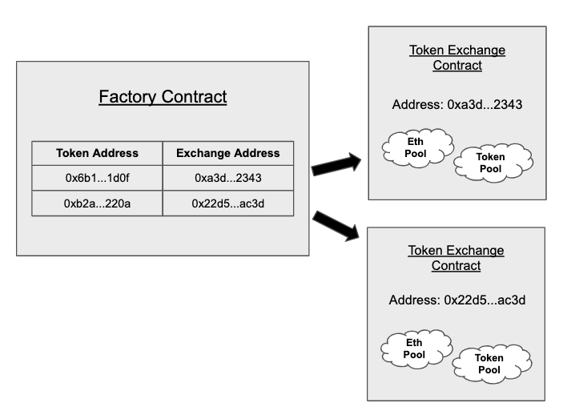

# Uniswap
## v1

* has a series of ETH-ERC20 exchange contracts. 1 exchange contract per ERC20 token. 
* trade ETH with ERC20 & vice versa.
* The Uniswap [factory contract](https://github.com/Uniswap/uniswap-v1/blob/master/contracts/uniswap_factory.vy) can be used to create exchange contracts for any ERC20 token that does not already have one. It also functions as a registry of ERC20 tokens that have been added to the system, and the exchange with which they are associated.
* The factory contract can be instantiated using the factory address and ABI: For more, click [here](https://docs.uniswap.org/protocol/V1/guides/connect-to-uniswap)
* In this version, in order to get a trade b/w DAI to USDC:
	1. DAI to ETH
	1. ETH to USDC
* Provide liquidity: it requires depositing an equivalent value of both ETH and the relevant ERC20 token.
* Exchange rate: The token price is determined via "constant product" market making formula which sets the exchange rate based off 
	- of the relative size of the ETH and ERC20 reserves &,
	- the amount with which an incoming trade shifts this ratio.
* Price slippage: When someone sells ETH with ERC20 token, the ETH reserve ⬆ => hence, the price of ETH w.r.t ERC20 token ⬇. Such kind of scenario occurs when the reserve size is less.
* Pool token:
	- Minting: Pool tokens are minted when liquidity is deposited into the system
	- Burning: Pool tokens can be burned at any time to withdraw a proportional share of the reserves. These LP tokens can then be staked or burned to redeem rewards. A 0.3% trading fee is incurred to reward the liquidity providers.
* Fees:
	- liquidity provider fee (0.3%) to reward the LPs

## v2
* The major drawback with the Uniswap v1 was the “ETH bridging” problem, i.e., the absence of ERC20-ERC20 token pools. This resulted in escalated costs and high slippage when a user wants to swap one ERC20 token.
* v2 solved the problem by introducing ERC20-ERC20 pools.
* In v2, a trade b/w DAI to USDC can directly happen.
* v2 also introduced the wrapped ETH tokens to solve the problem of sending/receiving ERC20 tokens to/from a contract. [Read more](https://academy.binance.com/en/glossary/wrapped-ether)

> NOTE: ETH is not a ERC20 standard compatible token.

* protocol fee or admin fee is introduced in v2 other than the LPs' fee. This is 0.05% of total LPs fee (0.3%).

## v3

## References
* [Uniswap Tutorial for Developers (Solidity & Javascript)](https://www.youtube.com/watch?v=0Im5iaYoz1Y)
* [How to set the token price in a liquidity pool? (Uniswap, Pancake)](https://www.youtube.com/watch?v=yzdh5RRWxAk)
* [Buy & Sell tokens on Uniswap with NodeJS / Javascript](https://www.youtube.com/watch?v=QgBweHjhh1g)
* [Fork Uniswap & Create Your Own Sushiswap | Full Tutorial](https://www.youtube.com/watch?v=U3fTTqHy7F4)
* [Developer walks you through the code of Uniswap V3](https://www.youtube.com/watch?v=WCLsIcjLSXc)
* [A Graphical Guide for Understanding Uniswap](https://docs.ethhub.io/guides/graphical-guide-for-understanding-uniswap/)