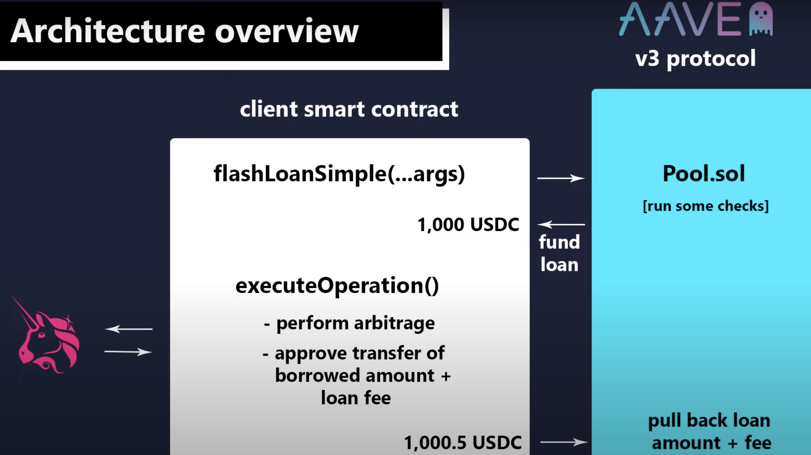
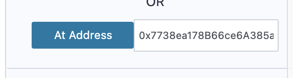
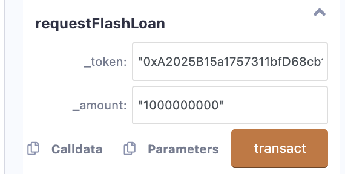
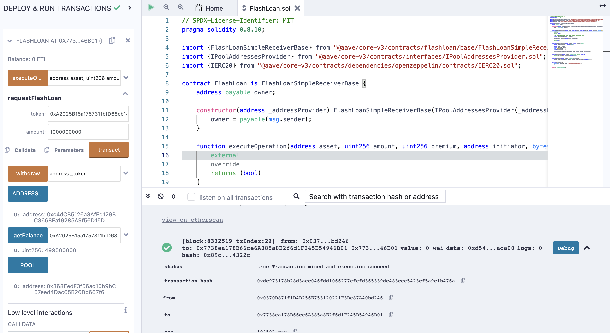
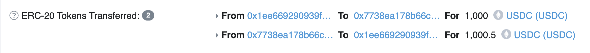

# Aave

## Overview

One of the lending & borrowing Protocol for DeFi


**Features**:

- Lending & Borrowing
- Flash Loans (`batch` in v2)
- Governance (`new` in v2)
  - gov token i.e. `aToken` is used for delegation
- All `aToken` are ERC20 tokens which has approve/transfer functions as gas-less (EIP-2612).

### When to use Aave as a Lender

- You want to earn interest on your unused assets
- `aToken` received as LP Token in Aave AMM which is rewarded with accrued interest based on protocol parameters & demand.

---

The solidity code for "**Deposit ERC20 -> Receive aToken (1:1)**":

```solidity
address asset = address(0x6B175474E89094C44Da98b954EedeAC495271d0F);    // DAI
uint256 amount = 100 * 1e18; // 100 DAI
address onBehalfOf = msg.sender;   // depositor
uint16 referralCode = 0;    // 0 for no referral, 1 for Aave referral, 2 for Referral 2, etc. it's mainly for affiliate program to earn referral fees.

IERC20(asset).approve(address(lendingPool), amount);
lendingPool.deposit(asset, amount, onBehalfOf, referralCode);
```

---

Similarly for "**withdraw aToken -> Receive ERC20**":

```solidity
address asset = address(0x6B175474E89094C44Da98b954EedeAC495271d0F);    // DAI
uint256 amount = uint256(-1); // max. amount
address to = msg.sender;   // receiver

lendingPool.withdraw(asset, amount, to);
```

### When to use Aave as a Borrower

- When you need to borrow assets
- Borrow assets based on the amount of collateral deposited (over-collateralized)
- Also can use `aToken` as collateral to borrow supported assets at either a stable or variable interest rate.

---

The solidity code for "**Locked `aToken` collateral -> Loans!**":

```solidity
address asset = address(0x6B175474E89094C44Da98b954EedeAC495271d0F);    // DAI
uint256 amount = 100 * 1e18; // 100 DAI
uint256 interestRateMode = 1;    // 1 for stable, 2 for variable
uint16 referralCode = 0;
address onBehalfOf = msg.sender;   // borrower

lendingPool.borrow(asset, amount, interestRateMode, referralCode, onBehalfOf);
```

---

Swap b/w variable & stable interest rate:

```solidity
address asset = address(0x6B175474E89094C44Da98b954EedeAC495271d0F);    // DAI
uint256 interestRateMode = 1;    // 1 for stable, 2 for variable

lendingPool.swapBorrowRateMode(asset, interestRateMode);
```

> Sometimes, the after-swap interest rate is not the same as the before-swap interest rate. This is because the interest rate is calculated based on the current market conditions. And it might be the case that the new interest rate is higher/lower than the previous one.

---

Repay the loan at any time:

```solidity
address asset = address(0x6B175474E89094C44Da98b954EedeAC495271d0F);    // DAI
uint256 amount = 100 * 1e18; // 100 DAI
uint256 interestRateMode = 1;    // 1 for stable, 2 for variable
address onBehalfOf = msg.sender;   // borrower

IERC20(asset).approve(address(lendingPool), amount);    // approve the SC to spend the DAI from borrower in order to repay the loan

lendingPool.repay(asset, amount, interestRateMode, onBehalfOf);
```

### Credit Delegation

💡 I think this is the most interesting feature of Aave.

- Users:
  - Delegator: The user who delegates their credit to another user.
  - Delegatee: The user who borrows on behalf of the delegator.
- Credit delegation allows a user to delegate their credit to another user.
- It means that the delegated user can borrow on behalf of the delegator.
- The delegator can also set a maximum amount of credit that can be borrowed on their behalf.

    

  Here, if `amountinWei` is set to `uint256(-1)`, then the delegated user can borrow upto any amount of DAI on behalf of the delegator. E.g. if the delegator has deposited 100 DAI as collateral, then the delegatee can use upto 100 DAI as delegator as collateral in order to borrow some other token.

  To create a credit delegated loan with repayment timeframe, one needs to create a SC on top of the existing suite of Aave contracts which will be responsible for the repayment of the loan.

  

> Q. If there is no collateral above then, don't you think it is dangerous for the loan to be defaulted.
>
> A.
> Yes, credit delegation can be risky for the lender if the borrower defaults on the loan. Without collateral to secure the loan, the lender may have difficulty recovering the borrowed funds in the event of default. This is why lenders will often perform thorough credit checks and evaluate the borrower's ability to repay the loan before granting credit. Additionally, lenders may also require that the borrower provide a personal guarantee or co-signer to reduce the risk of default.
>
> However, credit delegation can also be beneficial for both the lender and the borrower, as it allows the borrower to access credit that they may not have been able to obtain on their own. This can be especially useful for small businesses or individuals with limited credit history. It also allows the lender to earn interest on the loaned funds, and to potentially expand their customer base.


### Flash loans

- Flash loans are a special type of loan that allow users to borrow funds without collateral.
- It all happens in 1 block, also called One Block Borrows
- Mostly developers require flash loans to perform arbitrage or to perform some other complex operations. So, very less GUI like furucombo, etc. provide flash loans.
- [EIP-3156: Flash Loans](https://eips.ethereum.org/EIPS/eip-3156)


---

Use cases

- **Collateral Swap**


- **Arbitrage**


- **Batch Flash Loans**


---

Code for flash loan contract:


Code for executing flash loan:


---


### Governance

Aave governance is a decentralized, permissionless, and transparent process that allows the community to vote on proposals that affect the protocol.


---

delegate voting power to a delegatee:


---

Submit on-chain vote:


---

Staking in governance:


### Platform integration


## Getting Started

> Aave v3 used here.

### Protocol

### Flash loan

1. Get faucets (DAI, USDC, USDT, LINK, [GoerliETH](https://goerlifaucet.com/)) for testnet from [here](https://app.aave.com/faucet/).
   
2. Sequence of steps:


```
`AavePoolSC::flashLoan()` or `AavePoolSC::flashLoanSimple()` called by EOA
- `transfer` requested amount of token to CustomFlashLoanSC
- `transferFrom` requested amount of token from CustomFlashLoanSC (inclusive of fees)
```

```
`CustomFlashLoanSC::executeOperation()` called by Aave flashloan SC
- use borrowed fund & then make collateralSwap, Arbitrage via logic inside the function
- `approve` borrowed token amount (inclusive of fees)
```

> No `transfer()` function has to be used inside `executeOperation()`, but just `approve()` the (requested + fees) amount of borrowed token. It is done by Aave flashloan SC.

**Architecture**



## Getting Started

Steps:

1. `npx hardhat`
2. `npm i @aave/core-v3 dotenv`
3. Add `PRIVATE_KEY`, `INFURA_GOERLI_ENDPOINT` values in `.env` file.
4. Write code for `CustomFlashLoan` contract in `FlashLoan.sol` file.
5. Write deploy script in `scripts/deployFlashLoan.js` file.
6. Parse the **PoolAddressesProvider** SC address into deploy() function of script as a constructor parameter. [Reference](https://docs.aave.com/developers/deployed-contracts/v3-testnet-addresses).
7. Build & deploy into Goerli testnet. Note down the address of `CustomFlashLoan` contract.
8. Open the project folder in Remix IDE using `remixd` CLI tool via `$ remixd -s .`
9. Change the environment in Remix IDE to **Injected Provider - Metamask**.
10. Paste the deployed SC address like this & press the button <kbd>At Address</kbd>
    
11. Call `requestFlashLoan()` function from the deployed SC address with token address & amount.
    
12. Confirm the transaction in Metamask & then view the transaction hash in Goerli Etherscan.



<u>Observations</u>:

- **CustomFlashLoan** contract is deployed on Goerli testnet at `0x7738ea178B66ce6A385a8E2f6d1F245B54946B01`.
- Aave's PoolAddressesProvider contract is `0xc4dCB5126a3AfEd129BC3668Ea19285A9f56D15D` on Goerli testnet. And this is used to get the address of Aave's flashloan contract using `getPool()` function. It is also used as a constructor parameter for deploying `CustomFlashLoan` contract.
- Let's request 1000 USDC using `CustomFlashLoan::requestFlashLoan()` from the **PoolAddressesProvider** contract. So, as per the logic inside `executeOperation()` function, the amount owed would be pulled back by the Aave's Pool SC. E.g. if we request 1000 USDC, then 1000 USDC + 0.05% of 1000 USDC = 1000.5 USDC would be pulled back by the Aave's Pool SC.
  > Here, there is no logic. Just receive & give it back with add-on fees. So, no profit made.
- You can see the transaction [here](https://goerli.etherscan.io/tx/0xdc973178b28d3aec046fdd1066277efefd365339dc483cee5423cf5a9c1b476a).

```
From 0x1ee669290939f8a8864497af3bc83728715265ffTo 0x7738ea178b66ce6a385a8e2f6d1f245b54946b01 For 1,000 USDC (USDC)
From 0x7738ea178b66ce6a385a8e2f6d1f245b54946b01To 0x1ee669290939f8a8864497af3bc83728715265ff For 1,000.5 USDC (USDC)
```



## References

- [Aave v3 contracts with The3D | Solidity Fridays](https://youtu.be/l5RKksbi8e8)
- All are **SAME**:
  - [Aave 101 for Devs](https://www.youtube.com/watch?v=pzVo1m_DK80) ✅
  - [Codeup 40: Aave v2 technical deep dive (featuring David Truong)](https://youtu.be/0gTMwmNdSRE) ✅
  - [Aave 101 for Developers [MarketMake] by ETHGlobal](https://www.youtube.com/watch?v=AMAMvKc-O2s) ✅
- [Aave: Flash Loans and Credit Delegation in Depth [MarketMake]](https://www.youtube.com/watch?v=MsDfTx1VzYA)
- [Flash Loan Arbitrage | Aave Flash Loan Tutorial | by Block Explorer](https://www.youtube.com/watch?v=PtMs8FZJhkU)
- [Aave Liquidity Pool Tutorial | DeFi Liquidity Pools | Crypto passive income | | by Block Explorer](https://www.youtube.com/watch?v=qs4KK9zD_9U)
- [Building in DeFi With Aave | freeCodeCamp — Lesson #10](https://www.youtube.com/watch?v=vgOnZkjifAs)
