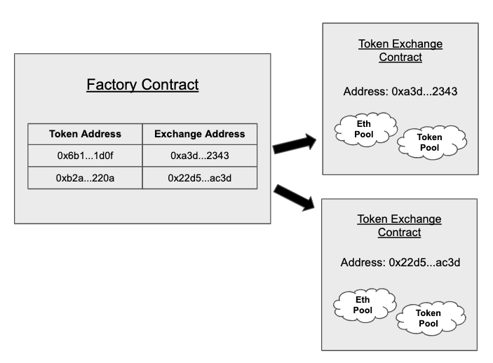

# Uniswap

## Versions

### v1



- has a series of ETH-ERC20 exchange contracts. 1 exchange contract per ERC20 token.
- trade ETH with ERC20 & vice versa.
- The Uniswap [factory contract](https://github.com/Uniswap/uniswap-v1/blob/master/contracts/uniswap_factory.vy) can be used to create exchange contracts for any ERC20 token that does not already have one. It also functions as a registry of ERC20 tokens that have been added to the system, and the exchange with which they are associated.
- The factory contract can be instantiated using the factory address and ABI: For more, click [here](https://docs.uniswap.org/protocol/V1/guides/connect-to-uniswap)
- In this version, in order to get a trade b/w DAI to USDC:

  1.  DAI to ETH
  2.  ETH to USDC

- Provide liquidity: it requires depositing an equivalent value of both ETH and the relevant ERC20 token.
- Exchange rate: The token price is determined via "constant product" market making formula which sets the exchange rate based off
  - of the relative size of the ETH and ERC20 reserves &,
  - the amount with which an incoming trade shifts this ratio.
- Price slippage: When someone sells ETH with ERC20 token, the ETH reserve ⬆ => hence, the price of ETH w.r.t ERC20 token ⬇. Such kind of scenario occurs when the reserve size is less.
- Pool token:
  - Minting: Pool tokens are minted when liquidity is deposited into the system
  - Burning: Pool tokens can be burned at any time to withdraw a proportional share of the reserves. These LP tokens can then be staked or burned to redeem rewards. A 0.3% trading fee is incurred to reward the liquidity providers.
- Fees:

  - liquidity provider fee (0.3%) to reward the LPs

- In return (profit), traders pay a _fee_ to the pool, distributed among Liquidity Provider(s) according to their shares.

---

### v2

- The major drawback with the Uniswap v1 was the “ETH bridging” problem, i.e., the absence of ERC20-ERC20 token pools. This resulted in escalated costs and high slippage when a user wants to swap one ERC20 token.
- v2 solved the problem by introducing ERC20-ERC20 pools.
- In v2, a trade b/w DAI to USDC can directly happen.
- v2 also introduced the wrapped ETH tokens to solve the problem of sending/receiving ERC20 tokens to/from a contract. [Read more](https://academy.binance.com/en/glossary/wrapped-ether)

> NOTE: ETH is not a ERC20 standard compatible token.

- protocol fee or admin fee is introduced in v2 other than the LPs' fee. This is 0.05% of total LPs fee (0.3%).

**[Maths](./maths.md)**

---

### v3

## Coding

- UniswapV2 contracts are divided into
  - **core contracts**: implements the complete functions of UniswapV2 (creating trading pairs, liquidity supply, trading tokens, price oracles, etc.)
    - Factory contract: The token registers & the exchange contract is generated.
    - Exchange contract
    - Pair (or Pool) contract
  - **peripheral contracts**: are used to make it more convenient for users to interact with the core contract in a user-friendly way.
- The price of token w.r.t another token is calculated on-chain within the smart contract ([example](https://github.com/abhi3700/evm_contracts_defiavgprice)), not off-chain.
- Calculate the price based on `xy = k` [Source](https://www.youtube.com/watch?v=IL7cRj5vzEU)

```
(x + dx)(y - dy) = k
dy = y - k/(x + dx)
dy = (xy + ydx - k)/(x + dx)
dy = (xy + ydx - xy)/(x + dx)
dy = ydx/( x + dx)

If the trading fee is `0.3%` => remaining dx becomes `0.997 * dx`

dy = y * 0.997 * dx/(x + 0.997 * dx)
```

## References

### Blogs

- [Introducing Uniswap V3](https://uniswap.org/blog/uniswap-v3/)
- [Whitepaper v3](https://uniswap.org/whitepaper-v3.pdf)
- [Whitepaper v2](https://uniswap.org/whitepaper.pdf)
- [Whitepaper v1](https://hackmd.io/@HaydenAdams/HJ9jLsfTz)
- [An analysis of Uniswap markets](https://web.stanford.edu/~guillean/papers/uniswap_analysis.pdf)
- [Contracts v1](https://github.com/Uniswap/uniswap-v1)
- [Contracts v2](https://github.com/Uniswap/uniswap-v2-core)
- [Contracts v3](https://github.com/Uniswap/uniswap-v3-core)
- [Documentation v3](https://docs.uniswap.org/)
- [Documentation v3](https://docs.uniswap.org/V2/concepts/protocol-overview/01-how-uniswap-works)
- [Documentation v1](https://docs.uniswap.org/V1/concepts/frontend-integration/01-connect-to-uniswap)

### Videos

- [Uniswap Tutorial for Developers (Solidity & Javascript)](https://www.youtube.com/watch?v=0Im5iaYoz1Y)
- [How to set the token price in a liquidity pool? (Uniswap, Pancake)](https://www.youtube.com/watch?v=yzdh5RRWxAk)
- [Buy & Sell tokens on Uniswap with NodeJS / Javascript](https://www.youtube.com/watch?v=QgBweHjhh1g)
- [Fork Uniswap & Create Your Own Sushiswap | Full Tutorial](https://www.youtube.com/watch?v=U3fTTqHy7F4)
- [Developer walks you through the code of Uniswap V3](https://www.youtube.com/watch?v=WCLsIcjLSXc)
- [A Graphical Guide for Understanding Uniswap](https://docs.ethhub.io/guides/graphical-guide-for-understanding-uniswap/)
- [The ultimate guide to use Uniswap](https://defitutorials.substack.com/p/the-ultimate-guide-to-uniswap)
