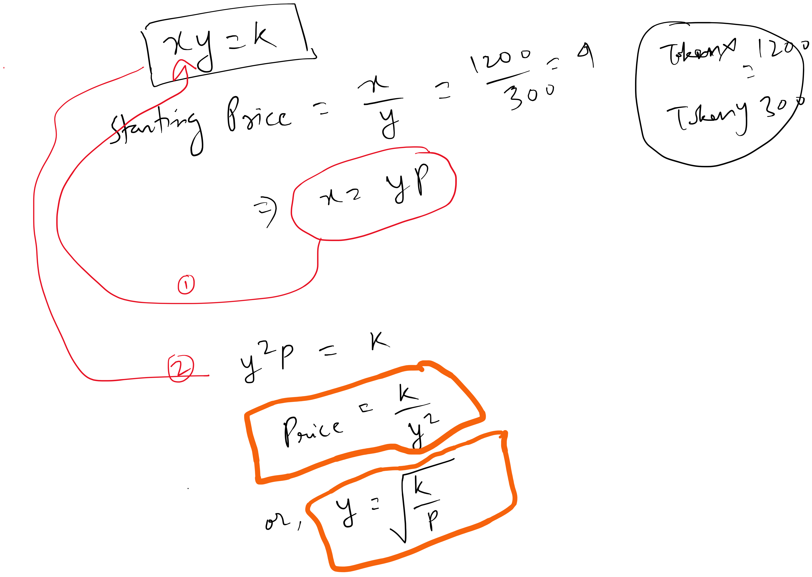
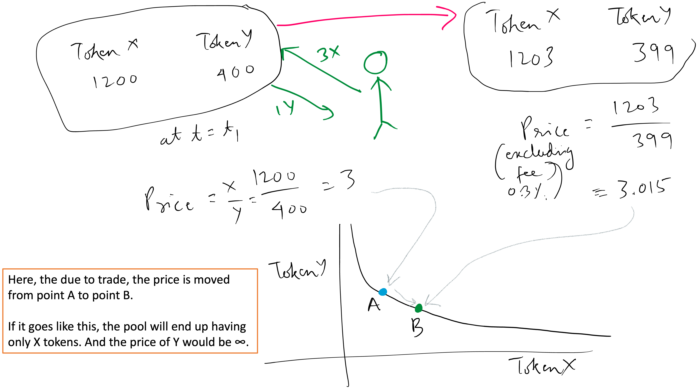
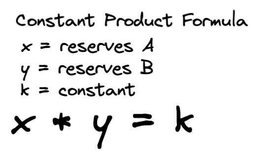
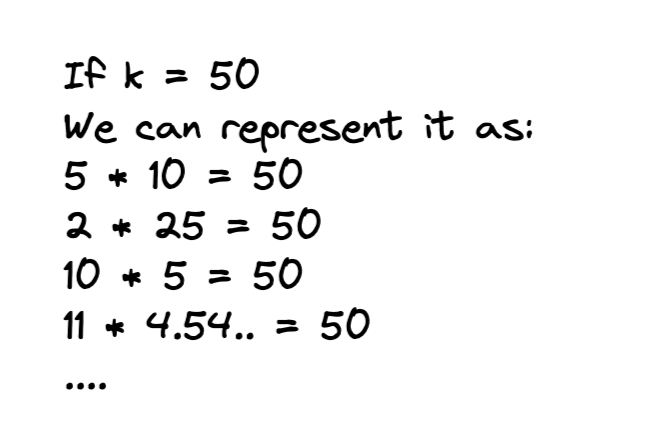

# Maths

Watch [this](https://www.youtube.com/watch?v=CLnlHto-030).

[PPT](./uniswap_v2.pptx)

## Calculate `y` from `xy=k` formula



## Looking at price before & after trade/swap



**Cons**: this creates a lot of volatility in v2 of Uniswap.

---

The AMM is chosen to be **Constant Product AMM (CPAMM)**.

This is because **CPAMM** is better than **Constant Sum AMM (CSAMM)** as in case of **CPAMM**, the straight line (`x + y = k`) touches both the axes. Hence, there is a possibility of either of reserve tokens going to zero. And at this point, there won't be any swap possible. And the whole purpose is forfeited.

> NOTE: **Stableswap AMM** is even better than **CPAMM** in terms of handling this issue: either of the reserve tokens going to zero. And that is something we might consider in future.

## Constant product formula



There are 2 scenarios where this k can behave differently:

### **Swap**:

`k` remains constant during inflow/outflow of `x` & `y`. In other words, we can change the value of `x` & `y`, but `k` remains constant. Here, `x` & `y` are the reserves of the tokens in the pool.


E.g. `x` and `y` are the reserves of the tokens in the pool. For example, if you are swapping `DAI` for `WETH`, you are interacting with the `DAI/WETH` smart contract pool. The total amount of `DAI` that the contract holds would be `x`, and the total amount of `WETH` would be `y`.

- Calculate the amount of output tokens based on `xy = k`. [Source](https://www.youtube.com/watch?v=IL7cRj5vzEU)

The following maths is used during swapping of tokens with or without trading fee.

Following is the calculation for amount of tokens to be received during swap:

Without trading/swap fee

```console
(x + dx)(y - dy) = k
or, (x + dx)(y - dy) = xy  [as k remains constant during swap]

dy = y - xy/(x + dx)
dy = (xy + ydx - xy)/(x + dx)
dy = ydx/( x + dx)
```

With trading/swap fee

```console
// Here, r = 1 - swap_fee = 1 - (0.3/1000) = 0.997
(x + rdx)(y - dy) = k
or, (x + dx)(y - dy) = xy [as k remains constant during swap]

dy = y - xy/(x + rdx)
dy = (xy + yrdx - xy)/(x + rdx)
dy = yrdx/( x + rdx)

//-----
E.g.
If the trading fee is `0.3%` => remaining dx becomes `0.997 * dx`

dy = y * 0.997 * dx/(x + (0.997 * dx))
```

### **Provide Liquidity**:

#### Addition

Just like `k` remains **constant** during swap, `relative_price` of reserve tokens in a pool remains **constant**.

So, during adding liquidity, this condition has to be checked:

```console
xy = k
(x + dx)(y + dy) = k'

No price change, before and after adding liquidity
x / y = (x + dx) / (y + dy)

x(y + dy) = y(x + dx)
x * dy = y * dx

x / y = dx / dy
dy = (y / x) * dx
```

Also, the amount of other reserve token that is acceptable for adding liquidity can be computed.

Next is the amount of liquidity tokens to be minted when liquidity token pair is added.
