# Uniswap v2 SC

This is about the elements of Uniswap **v2** SC.

- **Uniswapv2 SC Suite**

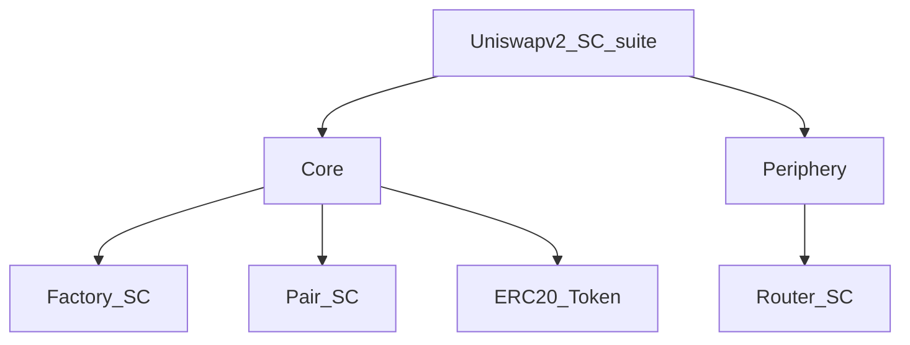

- **Core**:
  - **Factory SC**: creates pair contracts & keep tracks of all pair contracts.
  - **Pair SC**: implements mint/burn functions for LP tokens, swap of tokens.
  - **ERC20 Token**: Each pool has its individual pool token to keep track of ownership for the LPs.
- **Periphery**:
  - **Router SC**: This is a periphery SC which is used to interact with the core contracts. If required, the contract can be updated with new code deployed at a new address. There are 2 advantages associated with this:
    - If there is a trading of `USDC/DAI` & if there is no liquidity pool for this pair, but each token has a pool with `wETH`. In this case, the router contract would automatically make the trade of `USDC->wETH` & then `wETH->DAI`.
    - If the trader wants to send Ether directly to Router for getting a coin, the contract automatically takes care of the wETH part. Otherwise, if the trader has to interact directly with a pair contract (e.g. ETH/USDC), then wrapped Ether (ERC20) has to traded with for the required coin.

Below is the actual (recommended) workflow for the **Trader** & **LPs**:

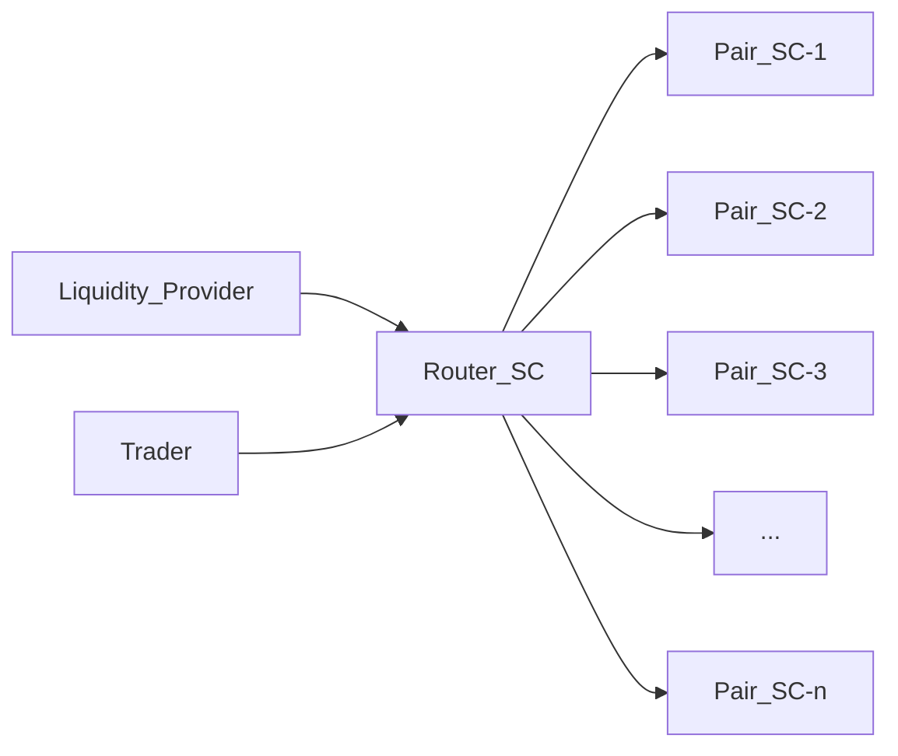

---

## Factory

Handles 2 things:

- setting of `feeTo` & `feeToSetter` (recipient of '0.3%' fees per trade). In future, it might be set to '0.05%' additional which will go to `feeTo` address.
- create pair contracts for a pair of tokens.

`feeToSetter` can change `feeTo` & `feeToSetter` addresses.


Use the mapping to store the pair contract address for 2 tokens - A & B.
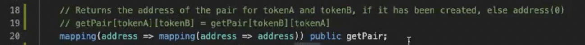

get all the pair SCs in array.A check of non-zero address for 1 (smaller) token only & also when adding to `getPair` mapping, it is arranged `getPair[tokenA][tokenB]` where `tokenA` < `tokenB`. This ensures unique storage into mapping for a token pair (compare & push). This means no possibility of `getPair[tokenB][tokenA]` as comparison is already done & pushed into mapping with `index-0` value smaller than `index-1`.


> NOTE: Additionally `checkContract()` function can be run in order to check if the token contract(s) really exist.

> Here, comparo b/w address is done by first converting hexadecimal to decimal & then comparison.

Event is fired when the pair SC is created using `createPair()` function
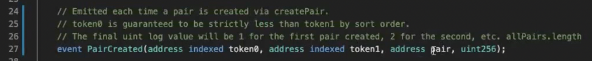

Constructor with `feeToSetter` param
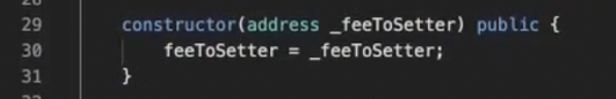

`feeToSetter` can change `feeTo` & `feeToSetter` addresses.
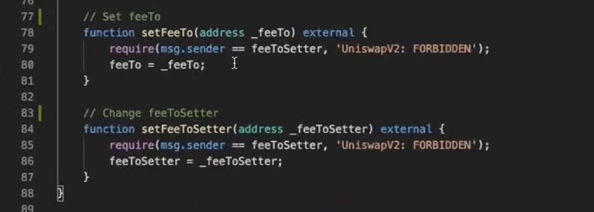

---

## LP Token (ERC20)

Each Uniswap V2 Pair contract instance extends on their own ERC20 implementation. This ERC20 is the Liquidity Provider token that you get in exchange for the provided underlying reserve tokens.

Amount of the LP token is calculated and minted within the Pair `mint()` function. Which is a low-level function not used directly from their UI. The Uniswap UI calls the Router's `addLiquidity()`, which is a wrapper function handling both underlying token transfers and mint of the LP token.

---

## Pair

Import files: lib, interface, contract
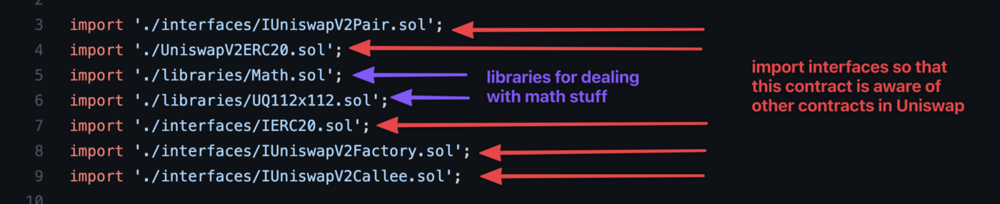

Contract Declaration:
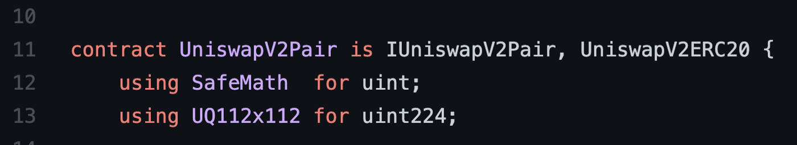

- `kLast`: last value of 'k' when updated during providing liquidity. Based on this, the exchange rate (token1/token0) is calculated.

  > NOTE: k remains constant during swap.

This is what happens during swap:
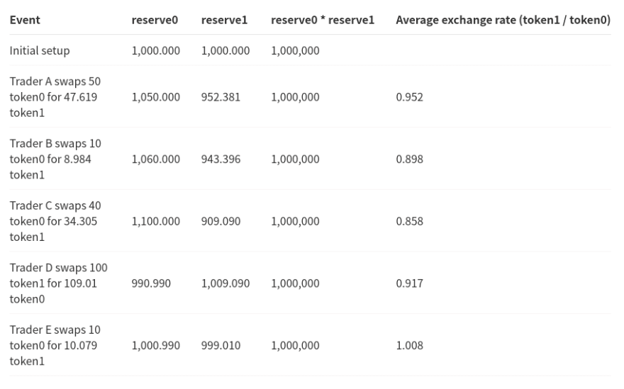

- `MINIMUM_LIQUIDITY` is the min. amount of liquidity burned at 1st liquidity provision.
- Here, `UniswapV2ERC20` is extended in order to incorporate managing pool ownership tokens. This contract inherits from `UniswapV2ERC20`, which provides the the ERC-20 functions for the liquidity tokens.
- `SafeMath` is not needed anymore for `^0.8.0` compiler. UQ112xUQ112 is a library for supporting `float` no.s. The 1st `112` bits is for whole no. & the last `112` bits is for fractional part.

Manage funds of the reserve tokens:
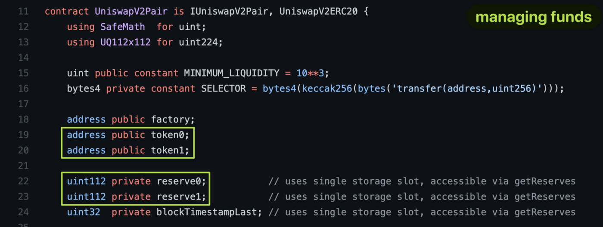

- So, here during swap, providing liquidity (add/remove), the token values are tracked in form of reserves.
- And also, the token addresses are noted inside.
- From the ERC20’s perspective, the Pair contract is just a regular user that can transfer and receive tokens, it has its own balance, etc.

Management b/w 3 contracts: Pair, ERC20 tokens of reserve tokens
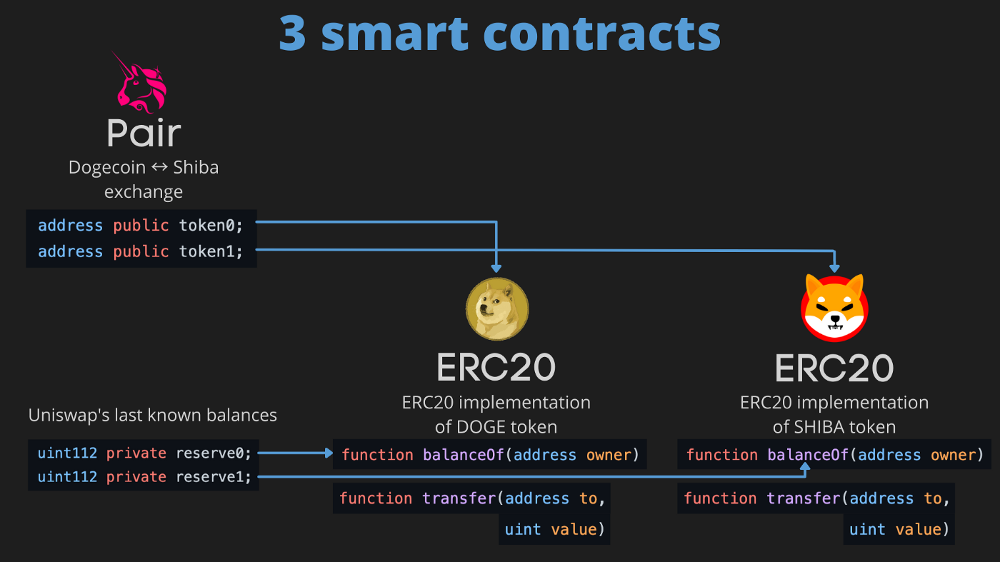

Now, the **Pair SC** use the 2 functions of ERC20 SC of reserve tokens:
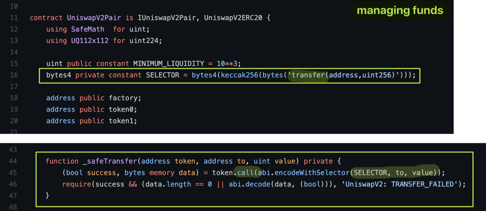

The Pair contract calls ERC20’s functions such as `balanceOf` (with `owner=Pair contract’s address`) and `transfer` to manage the tokens. Instead, `_safeTransfer` function can be used with function signature like this:

```solidity
function _safeTransfer(
    address token,
    address to,
    uint256 value
) private {
    (bool success, bytes memory data) = token.call(
        abi.encodeWithSignature("transfer(address,uint256)", to, value)
    );
    if (!success || (data.length != 0 && !abi.decode(data, (bool))))
        revert TransferFailed();
}
```
