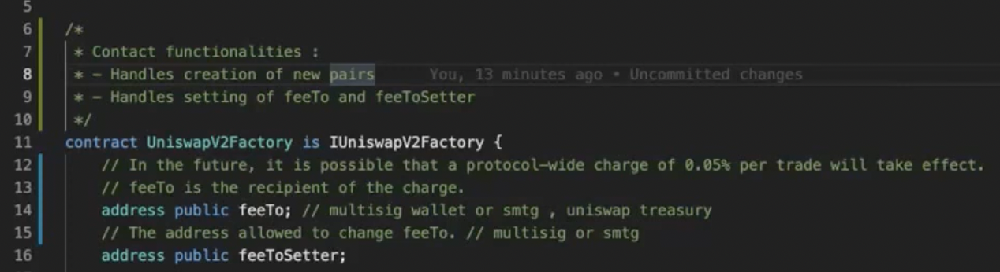
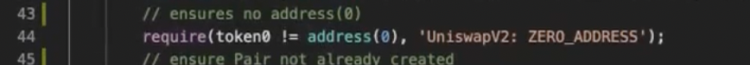

# Uniswap v2 SC

This is about the elements of Uniswap **v2** SC.

- **Uniswapv2 SC Suite**

- **Core**:
  - **Factory SC**: creates pair contracts & keep tracks of all pair contracts.
  - **Pair SC**: implements mint/burn functions for LP tokens, swap of tokens.
  - **ERC20 Token**: Each pool has its individual pool token to keep track of ownership for the LPs.
- **Periphery**:
  - **Router SC**: This is a periphery SC which is used to interact with the core contracts. If required, the contract can be updated with new code deployed at a new address. There are 2 advantages associated with this:
    - If there is a trading of `USDC/DAI` & if there is no liquidity pool for this pair, but each token has a pool with `wETH`. In this case, the router contract would automatically make the trade of `USDC->wETH` & then `wETH->DAI`.
    - If the trader wants to send Ether directly to Router for getting a coin, the contract automatically takes care of the wETH part. Otherwise, if the trader has to interact directly with a pair contract (e.g. ETH/USDC), then wrapped Ether (ERC20) has to traded with for the required coin.

Below is the actual (recommended) workflow for the **Trader** & **LPs**:

---

## Factory

Handles 2 things:

- setting of `feeTo` & `feeToSetter` (recipient of '0.3%' fees per trade). In future, it might be set to '0.05%' additional which will go to `feeTo` address.
- create pair contracts for a pair of tokens.

`feeToSetter` can change `feeTo` & `feeToSetter` addresses.

Use the mapping to store the pair contract address for 2 tokens - A & B.

get all the pair SCs in array.A check of non-zero address for 1 (smaller) token only & also when adding to `getPair` mapping, it is arranged `getPair[tokenA][tokenB]` where `tokenA` < `tokenB`. This ensures unique storage into mapping for a token pair (compare & push). This means no possibility of `getPair[tokenB][tokenA]` as comparison is already done & pushed into mapping with `index-0` value smaller than `index-1`.

> NOTE: Additionally `checkContract()` function can be run in order to check if the token contract(s) really exist.

> Here, comparo b/w address is done by first converting hexadecimal to decimal & then comparison.

Event is fired when the pair SC is created using `createPair()` function

Constructor with `feeToSetter` param

`feeToSetter` can change `feeTo` & `feeToSetter` addresses.

---

## Pair

Import files: lib, interface, contract

